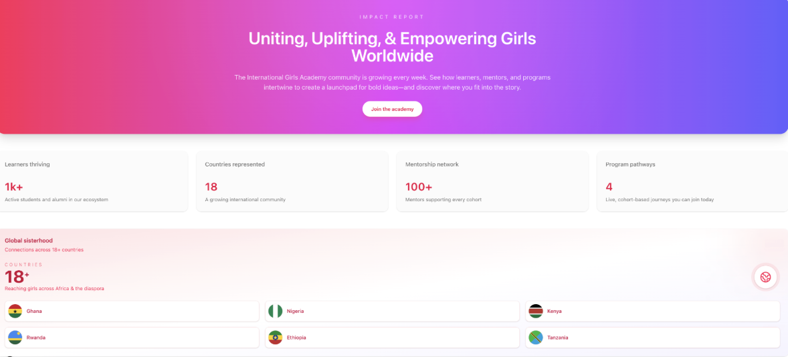
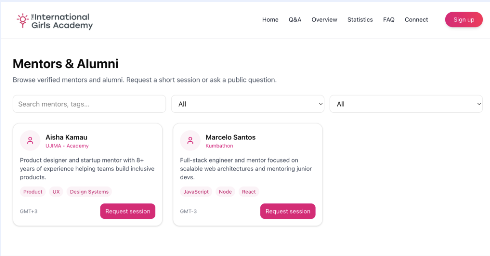
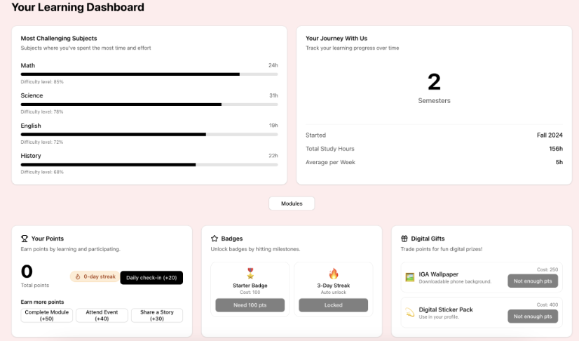
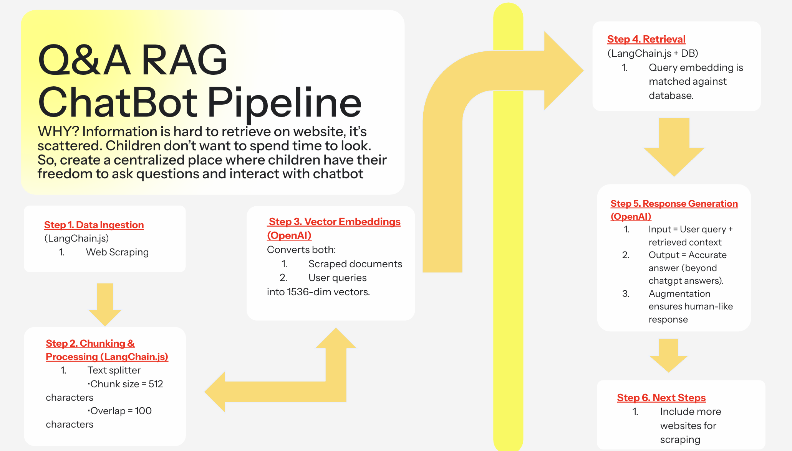

# IGA Pathways Platform

A web platform built for **The International Girls Academy (IGA)** to improve student onboarding, engagement, and retention.  
This project was developed for the hackathon to provide **a clear join flow, personalized event recommendations, and admin analytics.**

<p align="left">
  <a href="#product-preview"></a>
  <a href="#tech-stack"></a>
  <a href="#features"></a>
</p>

> **TL;DR** Built a single onboarding + engagement hub for IGA in one hackathon sprint so prospective students see proof quickly, admins get live retention analytics, and a LangChain-powered chatbot keeps FAQs off the support queue.

---

## Features

- **Welcome Video Homepage** – short intro to IGA mission and how to get started.  
- **Sign Up Form** – collects name, age, location, school/work, and newsletter opt-in.  
- **Supabase Integration** – new users are stored in Postgres with secure auth.  
- **Quiz Recommendation System** – matches students to one of IGA’s 4 core events:  
  - Ujima Business Program  
  - Kumbathon  
  - Box of Hope & Love  
  - Academy  
- **User Dashboard** – view engagement data, progress on modules, and completed events.  
- **Admin Dashboard** – analytics on student retention, program funnels, and activity.  
- **Chatbot** – answers FAQs about IGA resources, programs, and events.  

---

## Product Preview

### Impact Report Landing

_Gives prospective students instant social proof with real enrollment, country, and mentorship metrics above the fold._

### Mentors & Alumni Marketplace

_Cuts mentor matching time by pairing filters and tags with vetted mentor cards so girls can request help in one click._

### Learner Dashboard

_Keeps learners accountable with time-on-task tracking, streak badges, and digital rewards that celebrate consistency._

### Q&A RAG Chatbot Pipeline

_Grounds answers in scraped IGA knowledge so the chatbot acts like a scoped mentor rather than a generic LLM._

---

## Tech Stack

### Frontend
- **Next.js (JavaScript)** – app + UI  
- **TailwindCSS** – styling  
- **Recharts** – analytics dashboards  

### Backend
- **Next.js API Routes** – server logic  
- **Supabase Auth** – login & role-based access  
- **Supabase Storage** – files and videos  

### Database
- **Supabase Postgres**  
  - `profiles`: user info (name, age, location, school, role, newsletter)  
  - `programs`: IGA programs/events  
  - `modules`: steps for each program  
  - `progress`: user progress on modules  
  - `engagement`: logs of activity  

### Deployment
- **Vercel** – frontend + API hosting  
- **Supabase** – database, auth, storage  

### Architecture & Rationale
Next.js handles the public site, dashboards, and API routes in a single codebase so we can share types, server components, and caching strategies for quick loads on low-bandwidth devices. Supabase Postgres keeps auth, progress, and content in sync while LangChain + OpenAI embeddings run against Astra DB vectors to power the grounded chatbot without bespoke infrastructure.

---

## Getting Started

### 1. Clone Repo & Install
```bash
git clone <repo-url>
cd team-19-iga
npm install --force
```
Using `--force` helps bypass some peer-dependency warnings we currently have in the lockfile.

### 2. Set up environment variables
Create a local env file (ignored by git) and fill in your secrets:
```bash
cp .env.example .env.local
```

**Supabase database URL:**
- In the Supabase dashboard, open **Project Settings → Database → Connection string**.
- Copy the `URI` value and set it as `DATABASE_URL` in `team-19-iga/.env.local`.
- Everyone on the team can use the same connection string—no local Postgres setup required.

### 3. Add third-party API keys
Populate these variables in `team-19-iga/.env.local` with your own credentials:
- `SUPABASE_URL`, `SUPABASE_ANON_KEY`, `SUPABASE_SERVICE_ROLE_KEY`
- `NEXT_PUBLIC_APP_URL` (usually `http://localhost:3000` for local dev)
- `OPENAI_API_KEY`
- `ASTRA_DB_NAMESPACE` (or `ASTRA_DB_KEYSPACE`), `ASTRA_DB_COLLECTION`, `ASTRA_DB_API_ENDPOINT`, `ASTRA_DB_APPLICATION_TOKEN`

Never commit real keys—keep them in your personal `.env.local`.

### 4. Run the app
Start the Next.js dev server:
```bash
npm run dev
